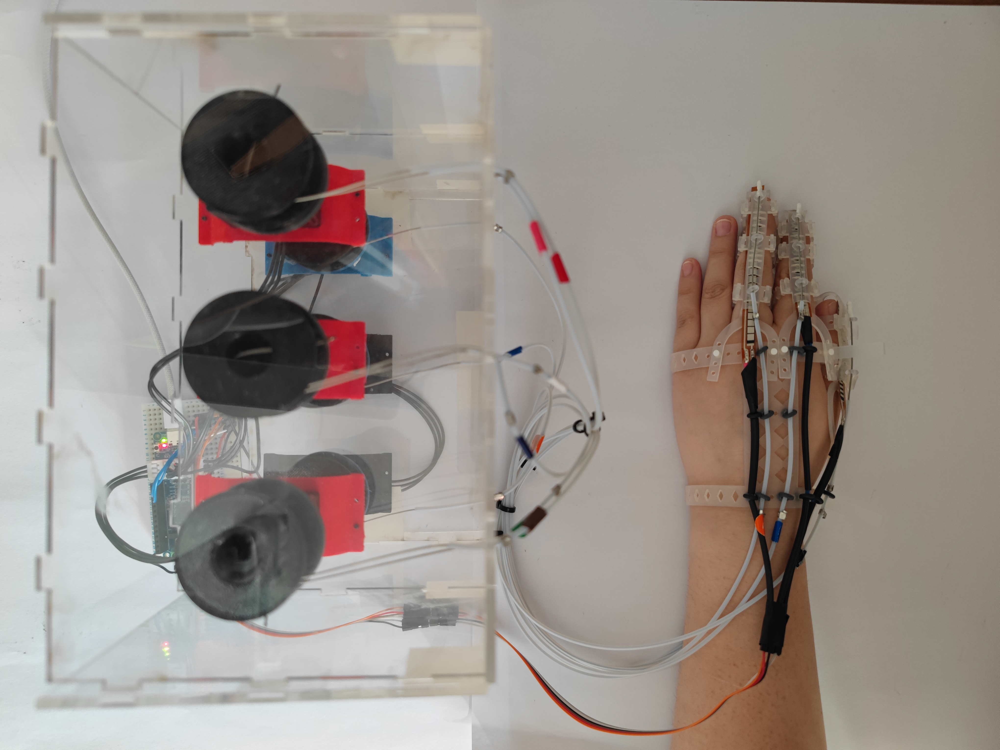

# Design and Closed-Loop Control of a Cable-Driven Soft Robotic Glove for Post-Stroke Rehabilitation
This project aims to construct a soft glove-based passive rehabilitation training system to serve the finger rehabilitation process of patients with upper limb motor dysfunction after stroke.

 


## Overview
This repository contains the complete implementation of a **cable-driven soft exoskeleton glove** developed for passive rehabilitation of post-stroke patients.  
The system enables repeatable flexion–extension cycles of the thumb, index, and middle fingers using cable-driven actuation with integrated sensing and closed-loop control.  

[](https://youtu.be/nIMEAH1Ccxk)

**Key Features:**
- Modular glove design with silicone structures and 3D-printed connectors.  
- Six Dynamixel XL330-M288-T motors for tendon-driven flexion/extension.  
- Flex sensor–based multimodal modeling framework (L–θ, R–L, R–θ mappings).  
- Closed-loop controller with sensor-based angle estimation (camera-free).  
- Complete experimental pipeline including tensile testing, data acquisition, modeling, and evaluation.  

---

## Repository Structure
```
Soft_glove/
├─ code/ # Source code
│ ├─ script/anagle_detect/ # Video-based joint angle extraction
│ │ ├─ angle_detect_index.py
│ │ ├─ angle_detect_middle.py
│ │ └─ angle_detect_thumb.py
│ ├─ script/model/ # Modeling scripts (L–θ, R–L, R–θ)
│ │ ├─ model_L_theta.py
│ │ ├─ model_R_L.py
│ │ ├─ model_R_theta_compose_active.py
│ │ └─ model_R_theta_direct.py
│ └─ OpenRB150/ # Embedded control firmware
│   ├─ flex_extend_sensor_test/
│   │ └─ flex_extend_sensor_test.ino
│   └─ close_loop_control/
│     └─ close_loop_control.ino
│
├─ data/ # Raw experimental data
│ ├─ raw/ # Serial data logs
│ └─ video/ # Video recordings for joint angle extraction
│
├─ output/ # Processed results
│ ├─ index_angles/ # Aligned data for index finger
│ │ └─ aligned_data_index.csv
│ ├─ middle_angles/ # Aligned data for middle finger
│ │ └─ aligned_data_middle.csv
│ ├─ thumb_angles/ # Aligned data for thumb
│ │ └─ aligned_data_thumb.csv
│ └─ control_results/ # Closed-loop control logs and evaluation plots
│
├─ models/ # Trained models (JSON/CSV/plots)
│ ├─ index/
│ │ ├─ L_theta/ L_theta_model.json, L_theta_summary_index.csv
│ │ ├─ R_L/ R_L_model.json, R_L_summary_index.csv
│ │ ├─ R_theta_direct/ R_theta_direct_model_index.json
│ │ └─ R_theta_compose_active/ (composed model + active session data)
│ ├─ middle/ # Similar structure, mainly R–L models
│ └─ thumb/ # Same as index
│
├─ images/ # Figures and plots for reports/papers
│ ├─ article/ # Final paper figures
│ ├─ design_sketch/ # Glove design illustrations
│ └─ soft_glove_test/ # Project photos
│
├─ SOLIDWORKS 2024/ # CAD models
│ ├─ Glove_final_design/ # Final glove design
│ ├─ 3D_Print_connector/ # Connector models
│ └─ other .SLDPRT files # Palm and finger modules
│
├─ tensile/ # Tensile testing data and results
└─ requirements.txt # Python dependencies
```

---

## Core Files

- **Final aligned data:**  
  - `output/index_angles/aligned_data_index.csv`  
  - `output/middle_angles/aligned_data_middle.csv`  
  - `output/thumb_angles/aligned_data_thumb.csv`  

- **Key trained models:**  
  - `models/index/L_theta/L_theta_model.json`  
  - `models/index/R_L/R_L_model.json`  
  - `models/index/R_theta_compose_active/R_theta_composed_model_ACTIVE.json`  

- **Control firmware:**  
  - `code/OpenRB150/close_loop_control/close_loop_control.ino`

---

## How to Use

1. **Preprocess video & sensor data**  
   Run scripts in `code/script/anagle_detect/` to extract joint angles from marker-based video.  

2. **Train models (L–θ, R–L, R–θ)**  
   Use the scripts in `code/script/model/` to fit regression models.  

3. **Upload firmware**  
   Flash `closeloop_control.ino` to the OpenRB-150 board.  

4. **Run closed-loop experiments**  
   Collect results in `output/control_results/` and visualize using provided Python scripts.  

---

## Notes
- The repository also contains **debug files, early tests, and discarded attempts** for completeness and reproducibility.  
- Final analysis and plots for the dissertation were generated from the files highlighted in **Core Files**.  

---


